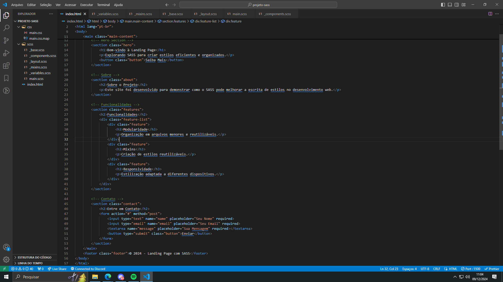
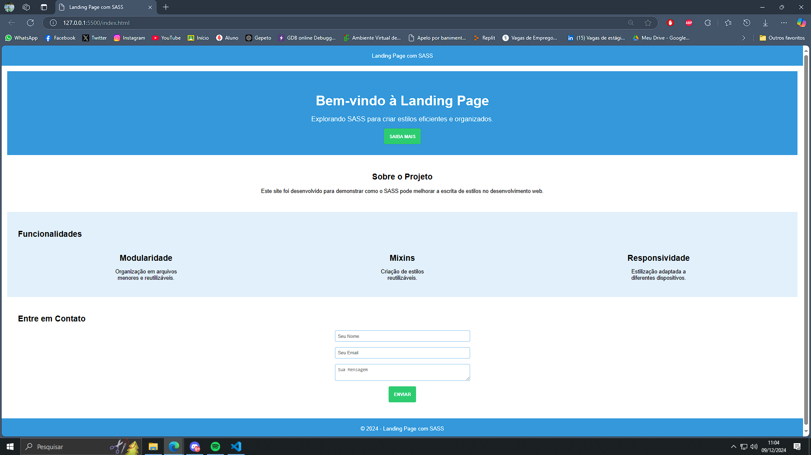

# Mini Projeto: Landing Page com SASS

##Autores: Emilha de Souza e Gustavo Rodrigues

Este repositório contém o desenvolvimento de uma **Landing Page** utilizando o pré-processador **SASS**. O objetivo principal é demonstrar como aplicar os conceitos de modularidade, reutilização de estilos e boas práticas no desenvolvimento web.

---

## 🎯 **Objetivo**

Criar uma landing page simples e responsiva, destacando funcionalidades do SASS como:  
- **Aninhamento** de seletores.  
- **Variáveis** para estilização consistente.  
- **Mixins** para reutilização de estilos.  
- **Partials** para organização de arquivos.

---

## 🛠️ **Instalação dos Softwares Necessários**

### **1. Node.js**  
- Faça o download e instale o Node.js a partir do site oficial:  
  [https://nodejs.org/](https://nodejs.org/)

### **2. SASS (via npm)**  
- Após instalar o Node.js, abra um terminal e execute:  
  ```bash
  npm install -g sass
  ```

### **3. Editor de Código**  
- Recomendamos o Visual Studio Code:  
  [https://code.visualstudio.com/](https://code.visualstudio.com/)

---

## 📖 **Passo-a-Passo para o Desenvolvimento**

### **1. Configuração do Ambiente**

1. **Crie uma pasta para o projeto:**  
   ```bash
   mkdir landing-page-sass
   cd landing-page-sass
   ```
2. **Inicialize o projeto com um arquivo HTML e pastas de estrutura básica:**  
   ```bash
   mkdir scss css
   touch index.html scss/main.scss
   ```

---

### **2. Estruturando o HTML**

Crie o arquivo `index.html` com o seguinte conteúdo básico:  

```html
<!DOCTYPE html>
<html lang="en">
<head>
    <meta charset="UTF-8">
    <meta name="viewport" content="width=device-width, initial-scale=1.0">
    <title>Landing Page com SASS</title>
    <link rel="stylesheet" href="css/main.css">
</head>
<body>
    <header class="header">Landing Page com SASS</header>
    <main class="main-content">
        <section class="hero">
            <h1>Bem-vindo à Landing Page</h1>
            <p>Explorando SASS para criar estilos eficientes e organizados.</p>
            <button class="button">Saiba Mais</button>
        </section>
        <footer class="footer">© 2024 - Landing Page com SASS</footer>
    </main>
</body>
</html>
```

---

### **3. Estilizando com SASS**

1. **Defina variáveis em `scss/_variables.scss`:**  
   ```scss
   $primary-color: #3498db;
   $secondary-color: #2ecc71;
   $spacing: 16px;
   ```

2. **Crie mixins em `scss/_mixins.scss`:**  
   ```scss
   @mixin center-content {
       display: flex;
       justify-content: center;
       align-items: center;
   }
   ```

3. **Estilize o layout em `scss/_layout.scss`:**  
   ```scss
   .hero {
       text-align: center;
       padding: $spacing * 2;
       background-color: $primary-color;
       color: #fff;

       h1 {
           font-size: 2.5rem;
       }

       p {
           margin-top: $spacing;
       }
   }
   ```

4. **Importe os arquivos no `scss/main.scss`:**  
   ```scss
   @import 'variables';
   @import 'mixins';
   @import 'layout';
   ```

---

### **4. Compilando SASS para CSS**

No terminal, execute o comando para compilar o SASS:  
```bash
sass scss/main.scss css/main.css --watch
```

> ⚙️ O parâmetro `--watch` recompila o arquivo sempre que houver alterações.

---

### **5. Visualizando o Projeto**

Abra o arquivo `index.html` em um navegador. Você verá uma página com:  
- Um título principal estilizado.  
- Um botão com hover e cores definidas por variáveis.  

---

## 📸 **Imagens do Processo**

### Estrutura do Projeto


### Página Finalizada


---

## 🎉 **Resultados Alcançados**

1. **Estilos Modularizados**: Utilização de partials para organização.  
2. **Reutilização de Código**: Uso de variáveis e mixins para consistência.  
3. **Projeto Responsivo**: Facilmente adaptável para diferentes telas.  

---

## 🧩 **Referências**

- Documentação oficial do SASS: [sass-lang.com](https://sass-lang.com)  
- Editor Visual Studio Code: [code.visualstudio.com](https://code.visualstudio.com)  
